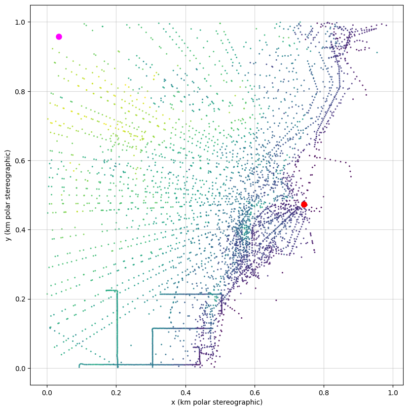

# BO4AIS

## Experiments:
- around Casey station
build ice flux data into the aquisition function
- Casey station skiway: Latitude: S-66.28822° E110.76919° (10 km from Casey)

## Paper title: Uncertainty-guided explorations stratgies for the Antarctic Ice Sheet

- related to active larning, environmental monitoring, eugenic search, 
- Refer to all Bayesian ice sheet representations: can be built on top

# Contributions
- aquisition function that integrates flux satellite observations
- showcase online and offline

## References to include

## Notes:
- IceQuest
- reconnaissance, survey, mapping, 
- mention ice coring 

## Data

- Phase-base ice velocity
    - Use speed as scalar 

- Online versus offline (Batch BO) scenario:
- Express benefit of interpreting data as we go.

## Coordinates
- Casey station in Polar Stereographic:

# Environment

Create a new environment named `bo4ais_env` with Python 3.10:

`conda create -n bo4ais_env python=3.10`

Follow the prompts to complete creation. Then activate the environment with:

`conda activate bo4ais_env`

To install the CUDA-enabled version of PyTorch, use the appropriate build for your system. Our experiments were run using a GPU with CUDA 12.1, so we install:

`pip install torch==2.5.1 torchvision torchaudio --index-url https://download.pytorch.org/whl/cu121`

Next, use pip to install all required packages from the requirements.txt file, as well as their dependencies. If you are just running on CPU, this will install everything you need.

Installation may take a few minutes.

`pip install -r BO4AIS/requirements.txt`

